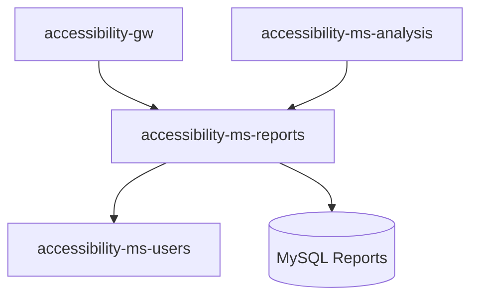

# 📊 accessibility-ms-reports

> 🚀 **Microservicio de generación de reportes y gestión de historial** para el ecosistema de accesibilidad web empresarial.

## ✨ Características principales

🎯 **API RESTful avanzada** para gestión completa de reportes e historiales de accesibilidad  
📋 **Generación automática de reportes** en múltiples formatos (PDF, HTML, JSON)  
🌐 **Internacionalización completa** con soporte multi-idioma (ES/EN)  
🔍 **Validación robusta** con FluentValidation y manejo global de errores  
📖 **Documentación OpenAPI/Swagger** interactiva y completa  
🧪 **Testing integral** con xUnit, base de datos InMemory y pruebas de integración  
🗄️ **Base de datos MySQL** optimizada con Entity Framework Core 9.0  
🐳 **Containerización Docker** lista para despliegue empresarial  
⚙️ **Configuración por entornos** automática (Development/Production/Testing)  
📊 **Cross-microservice integration** con accessibility-ms-analysis y accessibility-ms-users

---

## 🧭 Navegación rápida

- [🏗️ Estructura del proyecto](#️-estructura-del-proyecto)
- [📊 Enumeraciones y catálogos](#-enumeraciones-y-catálogos)
- [⚙️ Configuración de entornos](#️-configuración-de-entornos)
- [🗄️ Base de datos y arquitectura](#️-base-de-datos-y-arquitectura)
- [🌐 API endpoints y ejemplos](#-api-endpoints-y-ejemplos)
- [🐳 Despliegue y containerización](#-despliegue-y-containerización)

---

## 🏗️ Estructura del proyecto

```
📦 accessibility-ms-reports/
├── 📋 Directory.Packages.props          # Gestión centralizada de paquetes NuGet
├── 🐳 docker-compose.yml               # Orquestación de servicios
├── 📦 Dockerfile                       # Imagen multi-stage optimizada
├── 🛠️ init-reports-db.sql             # Scripts de inicialización de BD
├── 🧪 init-test-databases.ps1|sh       # Scripts de BD para testing
├── 📖 README.md                        # Documentación completa del proyecto
├── 🔧 Reports.sln                      # Solución .NET 9 principal
├── 📝 REVIEW.md                        # Guía de revisión de código
│
└── 📁 src/
    ├── 🎯 Reports.Api/                  # 🌐 API principal y configuración
    │   ├── ⚙️ appsettings.*.json       # Configuración por entornos
    │   ├── 🚀 Program.cs               # Punto de entrada y configuración DI
    │   ├── 📦 Reports.Api.csproj       # Proyecto principal de la API
    │   ├── 🎮 Controllers/             # Controladores REST (Report, History)
    │   └── 🔧 Helpers/                 # Utilidades y extensiones
    │
    ├── 💼 Reports.Application/          # 🧠 Lógica de negocio y servicios
    │   ├── 📋 DTOs/                    # Objetos de transferencia de datos
    │   ├── 🛡️ Validators/              # Validadores con FluentValidation
    │   └── ⚙️ Services/                # Servicios de aplicación
    │
    ├── 🏛️ Reports.Domain/              # 🎯 Entidades y reglas de dominio
    │   ├── 📊 Entities/                # Entidades principales (Report, History)
    │   └── 📋 Enums/                   # Enumeraciones del dominio
    │
    ├── 🔌 Reports.Infrastructure/       # 🗄️ Acceso a datos y servicios externos
    │   ├── 🗃️ Data/                   # DbContext y configuración EF Core
    │   ├── 🔄 Migrations/              # Migraciones de base de datos
    │   └── 📦 ServiceRegistration.cs   # Registro de servicios DI
    │
    └── 🧪 Reports.Tests/               # ✅ Pruebas integrales automatizadas
        ├── 🎮 Controllers/             # Tests de controladores
        ├── 🏗️ Infrastructure/          # TestWebApplicationFactory
        └── 💼 Services/                # Tests de servicios de aplicación
```

## 📊 Enumeraciones y catálogos

### 📋 Formatos de reporte (ReportFormat)

| Valor  | Descripción                               | Soporte             |
| ------ | ----------------------------------------- | ------------------- |
| `PDF`  | Documento PDF optimizado para impresión   | ✅ **Implementado** |
| `HTML` | Página web interactiva con CSS responsive | ✅ **Implementado** |
| `JSON` | Datos estructurados para integración API  | ✅ **Implementado** |
| `CSV`  | Hoja de cálculo para análisis de datos    | 🔄 **Planificado**  |
| `XML`  | Formato XML para sistemas legacy          | 🔄 **Planificado**  |

### 📈 Estados de reporte (ReportStatus)

| Estado       | Descripción                      | Flujo de trabajo       |
| ------------ | -------------------------------- | ---------------------- |
| `PENDING`    | Reporte en cola de generación    | ⏳ **Inicial**         |
| `GENERATING` | Procesando contenido del reporte | 🔄 **En progreso**     |
| `COMPLETED`  | Reporte generado exitosamente    | ✅ **Final exitoso**   |
| `FAILED`     | Error durante la generación      | ❌ **Final con error** |
| `EXPIRED`    | Reporte caducado (>30 días)      | 🗑️ **Archivado**       |

### 🎯 Tipos de historial (HistoryType)

| Tipo         | Descripción                    | Propósito                      |
| ------------ | ------------------------------ | ------------------------------ |
| `GENERATION` | Generación de nuevo reporte    | 📊 **Auditoría de creación**   |
| `DOWNLOAD`   | Descarga de reporte existente  | 📥 **Tracking de acceso**      |
| `DELETION`   | Eliminación de reporte         | 🗑️ **Auditoría de borrado**    |
| `SHARING`    | Compartir reporte con terceros | 🔗 **Control de distribución** |

## ⚙️ Configuración de entornos

### 🌍 Detección automática de entornos

El microservicio implementa **detección automática inteligente** basada en `ASPNETCORE_ENVIRONMENT`:

| Entorno           | Base de datos | Migraciones            | SSL      | Configuración                   |
| ----------------- | ------------- | ---------------------- | -------- | ------------------------------- |
| `Development`     | **MySQL 8.4** | `MigrateAsync()`       | ❌ HTTP  | Desarrollo local con hot-reload |
| `Production`      | **MySQL 8.4** | `MigrateAsync()`       | ✅ HTTPS | Producción optimizada y segura  |
| `TestEnvironment` | **InMemory**  | `EnsureCreatedAsync()` | ❌ HTTP  | Tests automatizados y CI/CD     |

### 🔧 Variables de entorno (.env)

**📝 Configuración de desarrollo (.env.development):**

```bash
# === APLICACIÓN ===
ASPNETCORE_ENVIRONMENT=Development
ASPNETCORE_URLS=http://+:8083

# === BASE DE DATOS REPORTS ===
DB_NAME=reportsdb
DB_USER=reportsuser
DB_PASSWORD=ReportsApp2025SecurePass
DB_ROOT_PASSWORD=cH9QM3YwWOJJZaZ3ZyYloMqU6dcDCWiN
DB_PORT=3309

# === CONFIGURACIÓN DE SERVICIO ===
API_HOST_PORT=8083
API_VERSION=v1
ENABLE_SWAGGER=true

# === CONEXIÓN CROSS-MICROSERVICES ===
ANALYSIS_API_URL=http://accessibility-ms-analysis:5002
USERS_API_URL=http://accessibility-ms-users:5001

# === GENERACIÓN DE REPORTES ===
MAX_REPORT_SIZE_MB=50
REPORT_RETENTION_DAYS=30
CONCURRENT_REPORTS_LIMIT=10
DEFAULT_REPORT_FORMAT=PDF

# === INTERNACIONALIZACIÓN ===
DEFAULT_CULTURE=es-ES
SUPPORTED_CULTURES=es-ES,en-US
ENABLE_LOCALIZATION=true
```

**🔒 Configuración de producción (.env.production):**

```bash
# === APLICACIÓN PRODUCCIÓN ===
ASPNETCORE_ENVIRONMENT=Production
ASPNETCORE_URLS=https://+:8443;http://+:8083

# === BASE DE DATOS SEGURA ===
DB_NAME=reportsdb_prod
DB_USER=reportsuser_prod
DB_PASSWORD=ReportsApp2025SecurePassPROD_$(Generate-RandomString)
DB_ROOT_PASSWORD=cH9QM3YwWOJJZaZ3ZyYloMqU6dcDCWiNPROD_$(Generate-RandomString)
DB_PORT=3309

# === CONFIGURACIÓN DE PRODUCCIÓN ===
API_HOST_PORT=8083
API_HTTPS_PORT=8443
ENABLE_SWAGGER=false
ENABLE_SSL=true

# === MYSQL OPTIMIZADA ===
MYSQL_CHARSET=utf8mb4
MYSQL_COLLATION=utf8mb4_unicode_ci
MYSQL_MAX_CONNECTIONS=200
MYSQL_INNODB_BUFFER_POOL_SIZE=1G

# === SEGURIDAD AVANZADA ===
JWT_SECRET=SuperSecretKeyForReports2025_$(Generate-RandomString)
JWT_EXPIRATION_MINUTES=60
API_KEY_HEADER=X-Reports-API-Key
CORS_ALLOWED_ORIGINS=https://reports.accessibility.local,https://admin.accessibility.local

# === LOGGING Y MONITOREO ===
SERILOG_MINIMUM_LEVEL=Warning
SERILOG_FILE_PATH=/app/logs/reports-{Date}.log
SERILOG_RETENTION_DAYS=90

# === MÉTRICAS DE RENDIMIENTO ===
ENABLE_METRICS=true
METRICS_PORT=9091
HEALTH_CHECK_TIMEOUT_SEC=15
```

> ⚠️ **Nota crítica de seguridad**: Los passwords mostrados son ejemplos para desarrollo. **OBLIGATORIO cambiar** antes de usar en producción. Usar generadores de passwords seguros de 32+ caracteres.

### 🔗 Comunicación inter-microservicio

**🌐 Puertos y servicios:**

| Microservicio                 | Puerto HTTP | Puerto HTTPS | Base de Datos |
| ----------------------------- | ----------- | ------------ | ------------- |
| **accessibility-ms-users**    | `5001`      | `5101`       | MySQL:3307    |
| **accessibility-ms-analysis** | `5002`      | `5102`       | MySQL:3308    |
| **accessibility-ms-reports**  | `5003`      | `5103`       | MySQL:3309    |
| **accessibility-gw**          | `8100`      | `8443`       | N/A (Gateway) |

**� Flujo de integración:**



## � Compilación y ejecución

### 🛠️ Desarrollo local

```bash
# Restaurar dependencias NuGet
dotnet restore Reports.sln

# Compilar en modo desarrollo
dotnet build Reports.sln --configuration Debug

# Ejecutar con recarga automática
dotnet watch run --project src/Reports.Api --environment Development

# Ejecutar en puerto específico
dotnet run --project src/Reports.Api --urls "http://localhost:8083"
```

### 🏗️ Build optimizado

```bash
# Compilación optimizada para producción
dotnet build Reports.sln --configuration Release --no-restore

# Build con análisis de código
dotnet build Reports.sln -c Release --verbosity detailed

# Publicación optimizada
dotnet publish src/Reports.Api -c Release -o ./publish --self-contained false
```

### ✅ Ejecución de pruebas

```bash
# Todas las pruebas con output detallado
dotnet test Reports.sln --verbosity normal --configuration Release

# Solo pruebas de integración
dotnet test src/Reports.Tests --filter Category=Integration

# Pruebas con reporte de cobertura
dotnet test Reports.sln --collect:"XPlat Code Coverage" --results-directory TestResults

# Generar reporte HTML de cobertura
reportgenerator -reports:"TestResults/**/coverage.cobertura.xml" -targetdir:"TestResults/CoverageReport" -reporttypes:Html
```

## 🗄️ Base de datos y arquitectura

### 📊 Estructura de datos optimizada

El microservicio utiliza **MySQL 8.4** con Entity Framework Core y gestiona reportes e historial:

```
📊 REPORTS (tabla principal)
├── 📋 Relación con ANALYSIS (cross-microservice)
└── 📈 HISTORY (tracking de actividades)
    └── 👤 Relación con USERS (cross-microservice)
```

**Tablas principales:**

- **REPORTS** → Información de reportes generados con metadatos
- **HISTORY** → Historial de actividades y auditoría de reportes

### ⚡ Optimizaciones de rendimiento

**🔍 Índices especializados implementados:**

```sql
-- Consultas por análisis (más común)
CREATE INDEX idx_reports_analysis ON REPORTS(analysis_id);
CREATE INDEX idx_reports_format_date ON REPORTS(format, generation_date);
CREATE INDEX idx_reports_status ON REPORTS(status);

-- Historial por usuario y análisis
CREATE INDEX idx_history_user ON HISTORY(user_id);
CREATE INDEX idx_history_analysis ON HISTORY(analysis_id);
CREATE INDEX idx_history_type_date ON HISTORY(history_type, created_at);

-- Búsquedas por fecha (reportes y auditoría)
CREATE INDEX idx_reports_generation_date ON REPORTS(generation_date);
CREATE INDEX idx_history_created_at ON HISTORY(created_at);
```

**🔗 Integridad referencial cross-microservice:**

```sql
-- Relación con accessibility-ms-analysis
ALTER TABLE REPORTS ADD CONSTRAINT fk_reports_analysis
FOREIGN KEY (analysis_id) REFERENCES analysisdb.ANALYSIS(id) ON DELETE CASCADE;

-- Relación con accessibility-ms-users (a través de history)
ALTER TABLE HISTORY ADD CONSTRAINT fk_history_user
FOREIGN KEY (user_id) REFERENCES usersdb.USERS(id) ON DELETE CASCADE;

-- Cascada interna: Reports → History
ALTER TABLE HISTORY ADD CONSTRAINT fk_history_analysis
FOREIGN KEY (analysis_id) REFERENCES REPORTS(analysis_id) ON DELETE CASCADE;
```

### 🔄 Gestión de migraciones

```bash
# Aplicar todas las migraciones pendientes
dotnet ef database update --project src/Reports.Infrastructure --startup-project src/Reports.Api

# Generar nueva migración
dotnet ef migrations add NombreMigracion --project src/Reports.Infrastructure --startup-project src/Reports.Api

# Generar script SQL para revisión
dotnet ef migrations script --project src/Reports.Infrastructure --startup-project src/Reports.Api

# Rollback a migración específica
dotnet ef database update NombreMigracionAnterior --project src/Reports.Infrastructure --startup-project src/Reports.Api
```

> ⚠️ **Prerequisito importante**: Las constraints cross-microservice requieren que **accessibility-ms-analysis** y **accessibility-ms-users** estén funcionando y sus bases de datos creadas.

### 🧪 Base de datos de test

Para las pruebas se crean automáticamente bases de datos temporales:

```yaml
# Test Configuration
services:
  database-test:
    image: mysql:8.4
    environment:
      MYSQL_ROOT_PASSWORD: fK7SP6bZYRMMbdB6azbrpPtX9gfGGZlQ
      MYSQL_USER: testuser
      MYSQL_PASSWORD: TestApp2025SecurePass
    ports:
      - '3310:3306'
    volumes:
      - ./init-test-databases.sql:/docker-entrypoint-initdb.d/init.sql
```

**🛠️ Scripts de inicialización disponibles:**

- `init-test-databases.ps1` (Windows PowerShell)
- `init-test-databases.sh` (Linux/macOS)

## 🌐 API endpoints y ejemplos

### 📊 Endpoints de reportes

| 🎯 Acción                 | Método   | Endpoint                               | Descripción                                    |
| ------------------------- | -------- | -------------------------------------- | ---------------------------------------------- |
| **Crear reporte**         | `POST`   | `/api/report`                          | Genera nuevo reporte de accesibilidad          |
| **Obtener reporte**       | `GET`    | `/api/report/{id}`                     | Recupera reporte específico con metadatos      |
| **Reportes por análisis** | `GET`    | `/api/report/by-analysis/{analysisId}` | Obtiene reportes de un análisis específico     |
| **Reportes por fecha**    | `GET`    | `/api/report/by-date/{date}`           | Obtiene reportes generados en fecha específica |
| **Reportes por formato**  | `GET`    | `/api/report/by-format/{format}`       | Filtra reportes por formato (PDF, HTML, JSON)  |
| **Eliminar reporte**      | `DELETE` | `/api/report/{id}`                     | Elimina reporte y archivos asociados           |

### 📈 Endpoints de historial

| 🎯 Acción                  | Método   | Endpoint                                | Descripción                                 |
| -------------------------- | -------- | --------------------------------------- | ------------------------------------------- |
| **Crear historial**        | `POST`   | `/api/history`                          | Registra nueva actividad en el historial    |
| **Historial por usuario**  | `GET`    | `/api/history/by-user/{userId}`         | Obtiene historial completo del usuario      |
| **Historial por análisis** | `GET`    | `/api/history/by-analysis/{analysisId}` | Obtiene historial de un análisis específico |
| **Eliminar historial**     | `DELETE` | `/api/history/{id}`                     | Elimina entrada específica del historial    |

### 📝 Ejemplos de uso completo

**🚀 Crear nuevo reporte:**

```bash
curl -X POST "https://api.accessibility.local/api/report" \
  -H "Content-Type: application/json" \
  -H "Accept-Language: es" \
  -d '{
    "analysisId": 456,
    "format": "PDF",
    "filePath": "/reports/accessibility-report-456.pdf",
    "generationDate": "2025-08-31T14:30:00Z",
    "templateType": "comprehensive",
    "includeCharts": true,
    "includeRecommendations": true
  }'
```

**📊 Respuesta de reporte creado:**

```json
{
  "message": "Reporte creado correctamente.",
  "success": true,
  "data": {
    "id": 789,
    "analysisId": 456,
    "format": "PDF",
    "filePath": "/reports/accessibility-report-456.pdf",
    "generationDate": "2025-08-31T14:30:00Z",
    "status": "PENDING",
    "fileSize": null,
    "downloadUrl": null,
    "expirationDate": "2025-09-30T14:30:00Z",
    "createdAt": "2025-08-31T14:30:00Z",
    "updatedAt": "2025-08-31T14:30:00Z"
  }
}
```

**✅ Reporte completado con detalles:**

```bash
curl "https://api.accessibility.local/api/report/789" \
  -H "Accept-Language: es"
```

```json
{
  "message": "Reporte obtenido exitosamente.",
  "success": true,
  "data": {
    "id": 789,
    "analysisId": 456,
    "format": "PDF",
    "filePath": "/reports/accessibility-report-456.pdf",
    "generationDate": "2025-08-31T14:30:00Z",
    "status": "COMPLETED",
    "fileSize": 2048576,
    "downloadUrl": "https://api.accessibility.local/api/report/789/download",
    "expirationDate": "2025-09-30T14:30:00Z",
    "metadata": {
      "pages": 24,
      "violationsCount": 8,
      "passesCount": 156,
      "templateVersion": "2.1",
      "generationTimeMs": 3420
    },
    "createdAt": "2025-08-31T14:30:00Z",
    "updatedAt": "2025-08-31T14:32:25Z"
  }
}
```

**📈 Crear registro de historial:**

```bash
curl -X POST "https://api.accessibility.local/api/history" \
  -H "Content-Type: application/json" \
  -H "Accept-Language: es" \
  -d '{
    "userId": 42,
    "analysisId": 456,
    "historyType": "GENERATION",
    "description": "Reporte PDF generado automáticamente",
    "metadata": {
      "reportId": 789,
      "format": "PDF",
      "ipAddress": "192.168.1.100",
      "userAgent": "Mozilla/5.0..."
    }
  }'
```

**📊 Respuesta de historial creado:**

```json
{
  "message": "Historial creado correctamente.",
  "success": true,
  "data": {
    "id": 123,
    "userId": 42,
    "analysisId": 456,
    "historyType": "GENERATION",
    "description": "Reporte PDF generado automáticamente",
    "metadata": {
      "reportId": 789,
      "format": "PDF",
      "ipAddress": "192.168.1.100",
      "userAgent": "Mozilla/5.0..."
    },
    "createdAt": "2025-08-31T14:32:30Z",
    "updatedAt": "2025-08-31T14:32:30Z"
  }
}
```

### 🔍 Consultas avanzadas

**Reportes por análisis específico:**

```bash
# Obtener todos los reportes de un análisis
curl "https://api.accessibility.local/api/report/by-analysis/456" \
  -H "Accept-Language: es"
```

**Reportes por formato:**

```bash
# Solo reportes PDF
curl "https://api.accessibility.local/api/report/by-format/PDF" \
  -H "Accept-Language: es"

# Solo reportes HTML interactivos
curl "https://api.accessibility.local/api/report/by-format/HTML" \
  -H "Accept-Language: es"
```

**Historial completo por usuario:**

```bash
# Historial de actividades del usuario
curl "https://api.accessibility.local/api/history/by-user/42?page=1&pageSize=20" \
  -H "Accept-Language: es"
```

### 🚨 Manejo de errores y respuestas

**Respuestas de error estandarizadas:**

```json
// Error 400: Parámetros inválidos
{
  "success": false,
  "error": "Formato de reporte no válido. Formatos soportados: PDF, HTML, JSON",
  "details": {
    "field": "format",
    "value": "XLSX",
    "allowedValues": ["PDF", "HTML", "JSON"]
  },
  "timestamp": "2025-08-31T14:30:00Z",
  "path": "/api/report"
}

// Error 404: Recurso no encontrado
{
  "success": false,
  "error": "Reporte con ID 999 no encontrado",
  "timestamp": "2025-08-31T14:30:00Z",
  "path": "/api/report/999"
}

// Error 409: Conflicto de recursos
{
  "success": false,
  "error": "Ya existe un reporte en formato PDF para el análisis 456",
  "details": {
    "conflictingResource": "Report",
    "analysisId": 456,
    "existingFormat": "PDF"
  },
  "timestamp": "2025-08-31T14:30:00Z",
  "path": "/api/report"
}
```

**🎯 Códigos de estado HTTP:**

- `200 OK` → Operación exitosa
- `201 Created` → Recurso creado correctamente
- `204 No Content` → Eliminación exitosa
- `400 Bad Request` → Parámetros inválidos o malformados
- `404 Not Found` → Recurso no encontrado
- `409 Conflict` → Conflicto de recursos existentes
- `500 Internal Server Error` → Error interno del servidor

## 🐳 Despliegue y containerización

### 🐳 Configuración de Docker

**📦 Docker Compose para desarrollo:**

```yaml
# docker-compose.dev.yml
services:
  reports-api:
    build:
      context: .
      dockerfile: Dockerfile
    image: magodeveloper/accessibility-ms-reports:dev
    container_name: accessibility-reports-dev
    ports:
      - '5003:8083'
      - '5103:8443' # HTTPS
    environment:
      - ASPNETCORE_ENVIRONMENT=Development
      - ASPNETCORE_URLS=http://+:8083;https://+:8443
      - ConnectionStrings__Default=Server=reports-db;Port=3306;Database=reportsdb;Uid=reportsuser;Pwd=ReportsApp2025SecurePass;
      - ASPNETCORE_Kestrel__Certificates__Default__Password=dev-cert-password
      - ASPNETCORE_Kestrel__Certificates__Default__Path=/https/aspnetapp.pfx
    volumes:
      - ~/.aspnet/https:/https:ro
      - ./reports-storage:/app/reports
    depends_on:
      - reports-db
    networks:
      - accessibility-network

  reports-db:
    image: mysql:8.4
    container_name: accessibility-reports-db-dev
    ports:
      - '3309:3306'
    environment:
      MYSQL_ROOT_PASSWORD: cH9QM3YwWOJJZaZ3ZyYloMqU6dcDCWiN
      MYSQL_DATABASE: reportsdb
      MYSQL_USER: reportsuser
      MYSQL_PASSWORD: ReportsApp2025SecurePass
    volumes:
      - reports-db-data:/var/lib/mysql
      - ./init-reports-db.sql:/docker-entrypoint-initdb.d/init.sql
    networks:
      - accessibility-network

volumes:
  reports-db-data:
  reports-storage:

networks:
  accessibility-network:
    external: true
```

**🚀 Comandos de despliegue:**

```bash
# Construcción de imagen optimizada
docker build -t accessibility-ms-reports:latest .

# Desarrollo con recarga automática
docker-compose -f docker-compose.dev.yml up --build

# Producción con optimizaciones
docker-compose -f docker-compose.prod.yml up -d

# Logs en tiempo real
docker-compose logs -f reports-api

# Limpieza completa
docker-compose down -v && docker system prune -f
```

### ⚙️ Variables de entorno Docker

**🔧 Configuración avanzada (.env):**

```bash
# === APLICACIÓN ===
ASPNETCORE_ENVIRONMENT=Production
ASPNETCORE_URLS=https://+:8443;http://+:8083

# === ALMACENAMIENTO DE REPORTES ===
REPORTS_STORAGE_PATH=/app/reports
REPORTS_BASE_URL=https://reports.accessibility.local
REPORTS_MAX_FILE_SIZE_MB=100
REPORTS_CLEANUP_INTERVAL_HOURS=24

# === GENERACIÓN DE REPORTES ===
PDF_TEMPLATE_PATH=/app/templates/pdf
HTML_TEMPLATE_PATH=/app/templates/html
DEFAULT_FONT_FAMILY=Arial, sans-serif
ENABLE_WATERMARK=true
WATERMARK_TEXT=Generated by Accessibility Reports

# === PERFORMANCE Y CACHING ===
ENABLE_RESPONSE_CACHING=true
CACHE_DURATION_MINUTES=30
MAX_CONCURRENT_GENERATIONS=5
REPORT_GENERATION_TIMEOUT_MS=60000

# === INTEGRACIÓN CON OTROS MICROSERVICIOS ===
ANALYSIS_SERVICE_TIMEOUT_MS=30000
USERS_SERVICE_TIMEOUT_MS=15000
ENABLE_SERVICE_DISCOVERY=true
```

### 📊 Monitoreo y métricas

**🔍 Health checks implementados:**

- `/health` → Estado general del servicio
- `/health/ready` → Preparado para recibir tráfico
- `/health/live` → Servicio funcionando correctamente
- `/health/db` → Estado de conexión a base de datos

**📈 Métricas personalizadas disponibles:**

```csharp
// Métricas de generación de reportes
reports_generation_requests_total{format="PDF|HTML|JSON", status="success|error"}
reports_generation_duration_seconds{format="PDF|HTML|JSON"}
reports_active_generations_count
reports_storage_size_bytes

// Métricas de historial
history_events_total{type="GENERATION|DOWNLOAD|DELETION|SHARING"}
history_entries_count_by_user
history_retention_policy_cleanups_total

// Métricas de base de datos
database_reports_total_count
database_reports_by_status{status="PENDING|GENERATING|COMPLETED|FAILED|EXPIRED"}
database_history_entries_total
database_query_duration_seconds{operation="select|insert|update|delete"}

// Métricas de sistema
memory_usage_bytes
storage_usage_bytes{type="reports|templates|cache"}
http_requests_per_second{method="GET|POST|DELETE"}
```

### 🔗 Integración con ecosistema de microservicios

**🌐 Comunicación con accessibility-ms-analysis:**

```bash
# Obtener detalles de análisis para generar reporte
GET http://accessibility-ms-analysis:5002/api/analysis/{analysisId}

# Notificar que reporte ha sido generado
POST http://accessibility-ms-analysis:5002/api/analysis/{analysisId}/report-generated
{
  "reportId": 789,
  "format": "PDF",
  "downloadUrl": "https://reports.accessibility.local/api/report/789/download"
}
```

**👤 Comunicación con accessibility-ms-users:**

```bash
# Validar usuario antes de crear historial
GET http://accessibility-ms-users:5001/api/users/{userId}

# Registrar actividad de reporte en perfil de usuario
POST http://accessibility-ms-users:5001/api/users/{userId}/activity
{
  "activityType": "REPORT_GENERATED",
  "reportId": 789,
  "timestamp": "2025-08-31T14:32:30Z"
}
```

## 🌐 Internacionalización y localización

### 🗺️ Idiomas soportados

| Idioma        | Código  | Estado             | Cobertura |
| ------------- | ------- | ------------------ | --------- |
| **Español**   | `es-ES` | ✅ **Completo**    | 100%      |
| **Inglés**    | `en-US` | ✅ **Completo**    | 100%      |
| **Portugués** | `pt-BR` | 🔄 **Planificado** | 0%        |
| **Francés**   | `fr-FR` | 🔄 **Planificado** | 0%        |

### 🔧 Configuración de localización

**Headers de idioma soportados:**

```bash
# Español (por defecto)
Accept-Language: es-ES
Accept-Language: es

# Inglés
Accept-Language: en-US
Accept-Language: en

# Múltiples idiomas con prioridad
Accept-Language: en-US,en;q=0.9,es;q=0.8
```

**📝 Ejemplos de respuestas localizadas:**

```json
// Respuesta en español (es-ES)
{
  "message": "Reporte creado correctamente.",
  "success": true,
  "data": { /* ... */ }
}

// Respuesta en inglés (en-US)
{
  "message": "Report created successfully.",
  "success": true,
  "data": { /* ... */ }
}
```

### 📋 Archivos de recursos

```
📁 src/Reports.Api/Resources/
├── 🇪🇸 Messages.es.resx          # Mensajes en español
├── 🇺🇸 Messages.en.resx          # Mensajes en inglés
├── 🇪🇸 Validations.es.resx       # Validaciones en español
└── 🇺🇸 Validations.en.resx       # Validaciones en inglés
```

## 🚀 CI/CD y desarrollo

### 🔄 Pipeline automatizado

**GitHub Actions configurado para:**

✅ **Build y Tests automáticos**

- Compilación en .NET 9 con multiple targeting
- Ejecución de tests unitarios e integración
- Reporte de cobertura de código con Coverlet
- Análisis de calidad con SonarQube

✅ **Generación de reportes de prueba**

- Tests de generación PDF con bibliotecas reales
- Validación de plantillas HTML responsivas
- Pruebas de exportación JSON con esquemas
- Tests de performance para generación masiva

✅ **Despliegue automatizado**

- Build de imagen Docker multi-stage optimizada
- Push automático a Docker Hub y Azure Container Registry
- Deploy automático a entorno staging
- Deploy manual a producción con aprobaciones requeridas

✅ **Validaciones de seguridad**

- Escaneo de vulnerabilidades en dependencias NuGet
- Análisis SAST del código fuente C#
- Validación de configuraciones Docker y secretos

### 🛠️ Herramientas de desarrollo recomendadas

**IDEs y extensiones:**

- **Visual Studio 2022** con extensiones:
  - Entity Framework Core Power Tools
  - SonarLint para C#
  - Docker para Visual Studio
  - REST Client para pruebas de API
- **VS Code** con extensiones:
  - C# Dev Kit
  - REST Client
  - Docker y Docker Compose
  - GitLens para control de versiones

**🧪 Testing y depuración:**

```bash
# Tests con coverage detallado y filtros
dotnet test --collect:"XPlat Code Coverage" --filter Category!=Integration

# Generar reporte HTML de coverage con umbrales
reportgenerator -reports:"TestResults/**/coverage.cobertura.xml" -targetdir:"TestResults/CoverageReport" -reporttypes:Html -assemblyfilters:+Reports.*

# Tests de rendimiento específicos
dotnet test --filter Category=Performance --logger "console;verbosity=detailed"

# Depuración con logs estructurados
dotnet run --environment Development --verbosity diagnostic --property:EnableStructuredLogging=true
```

## 🔒 Consideraciones de seguridad

### 🛡️ Protecciones implementadas

✅ **Autenticación y autorización:**

- JWT tokens para autenticación de microservicios
- API Keys para servicios internos
- Rate limiting por endpoint y usuario
- CORS configurado específicamente por entorno

✅ **Validación y sanitización:**

- Validación estricta de formatos de reporte
- Sanitización de nombres de archivo y rutas
- Protección contra path traversal en storage
- Validación de tamaños de archivo y limits

✅ **Protección de datos:**

- Encriptación de URLs de descarga temporales
- Logs sanitizados sin información PII
- Almacenamiento seguro de reportes con TTL
- Configuración HTTPS obligatoria en producción

✅ **Auditoría y compliance:**

- Registro completo de actividades en historial
- Tracking de accesos y descargas de reportes
- Retention policies configurable por tipo de dato
- Logs de auditoría para compliance GDPR/CCPA

### ⚠️ Recomendaciones de producción

1. **🔐 Gestión de secretos**: Usar Azure Key Vault o equivalente para passwords y JWT secrets
2. **🌐 Red segura**: VPN/VPC para comunicación inter-microservicios sin exposición pública
3. **📊 Monitoreo activo**: Alertas automáticas para generaciones fallidas y accesos anómalos
4. **🔄 Respaldo**: Backup automático de reportes críticos y base de datos cada 6 horas
5. **📋 Auditoría**: Log estructurado de todas las operaciones con correlationId
6. **⏱️ Límites**: Timeouts apropiados y circuit breakers para evitar degradación
7. **🗑️ Limpieza**: Políticas de retention automático para reportes y logs antiguos

## 📚 Recursos adicionales

### 🔗 Enlaces útiles

- **[PDF Generation Best Practices](https://docs.microsoft.com/en-us/dotnet/core/extensions/pdf-generation)** → Guías para generación de PDF empresarial
- **[Entity Framework Core Docs](https://docs.microsoft.com/en-us/ef/core/)** → Documentación completa de EF Core 9.0
- **[ASP.NET Core Security](https://docs.microsoft.com/en-us/aspnet/core/security/)** → Mejores prácticas de seguridad
- **[Docker Multi-stage Builds](https://docs.docker.com/develop/dev-best-practices/)** → Optimización de imágenes Docker
- **[Localization in ASP.NET Core](https://docs.microsoft.com/en-us/aspnet/core/fundamentals/localization)** → Guía completa de i18n
- **[Health Checks in ASP.NET Core](https://docs.microsoft.com/en-us/aspnet/core/host-and-deploy/health-checks)** → Implementación de health checks

### 📖 Documentación técnica

- `docs/report-templates.md` → Plantillas y formatos de reporte disponibles
- `docs/api-specification.yaml` → Especificación completa OpenAPI 3.0
- `docs/deployment-guide.md` → Guía detallada de despliegue empresarial
- `docs/troubleshooting.md` → Resolución de problemas comunes
- `docs/performance-tuning.md` → Optimizaciones de rendimiento
- `docs/localization-guide.md` → Guía para añadir nuevos idiomas
- `docs/database-migrations.md` → Gestión de migraciones y versionado

---

## 🤝 Contribución y soporte

### 👥 Equipo de desarrollo

- **Tech Lead**: Arquitectura y diseño de microservicios
- **Backend Developer**: Implementación de lógica de negocio y APIs
- **UI/UX Designer**: Diseño de plantillas de reportes y experiencia de usuario
- **DevOps Engineer**: CI/CD, containerización y despliegue
- **QA Engineer**: Testing automatizado y aseguramiento de calidad

### 🐛 Reportar issues

1. **Issues en GitHub**: Usar **[GitHub Issues](../../issues)** para bugs y feature requests
2. **Información requerida**:
   - Versión del microservicio y entorno
   - Logs relevantes con correlationId
   - Pasos detallados para reproducir
   - Ejemplos de payloads que causan problemas
3. **Labels**: Usar etiquetas apropiadas (bug, enhancement, documentation, etc.)
4. **Prioridad**: Indicar severidad (critical, high, medium, low)

### ✨ Contribuir al proyecto

1. **Fork** del repositorio en GitHub
2. **Branch** para nueva funcionalidad: `git checkout -b feature/nueva-funcionalidad`
3. **Desarrollo** siguiendo estándares de código y documentación
4. **Tests** obligatorios para nueva funcionalidad con cobertura >85%
5. **Pull Request** con:
   - Descripción detallada de cambios
   - Tests que validan la funcionalidad
   - Documentación actualizada
   - Screenshots o ejemplos si aplica

### 📋 Estándares de código

- **C# Coding Standards**: Seguir convenciones de Microsoft y StyleCop
- **API Design**: RESTful siguiendo estándares OpenAPI 3.0
- **Testing**: Tests unitarios y de integración obligatorios
- **Documentation**: README actualizado y documentación inline
- **Commit Messages**: Seguir [Conventional Commits](https://conventionalcommits.org/)
- **Versioning**: Semantic Versioning (SemVer) estricto

---

> 💡 **¿Necesitas ayuda?** Consulta nuestra documentación técnica completa, revisa los issues existentes, o abre un nuevo issue con detalles específicos. El microservicio está diseñado para ser escalable y mantenible siguiendo arquitectura de microservicios empresarial.

**🎯 Versión:** 1.0.0 | **📅 Última actualización:** Agosto 2025 | **⚡ Estado:** Producción listo
